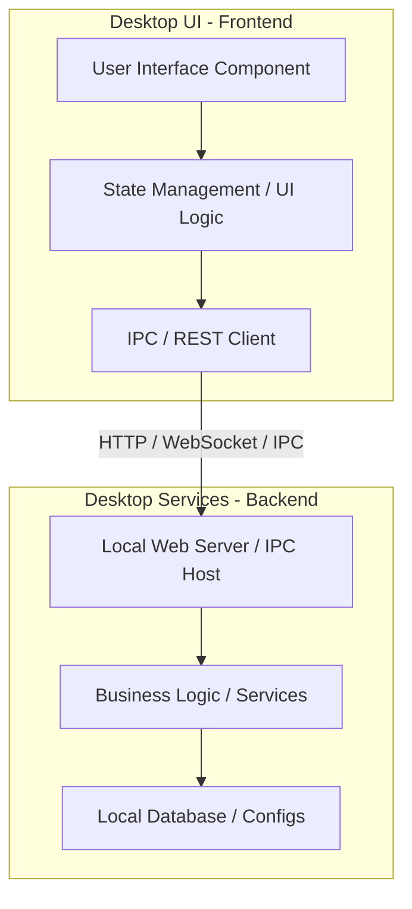

# Architecture Overview

This document describes the high-level architecture of the **Jinie Desktop Application**.

## System Components

### 1. Frontend (`frontend/`)
The frontend represents the desktop user interface. It is responsible for rendering views, handling user inputs, managing client-side application state, and communicating with the desktop backend.
* **Technology Stack:** typically built with a modern web framework (like React, Vue, or Next.js) packaged with a desktop shell container (such as Electron or Tauri).

### 2. Backend (`backend/`)
The backend is a lightweight Python-based service running locally on the user's machine. It handles heavier business logic, local OS operations, file system access, and external AI/API integrations.
* **Technology Stack:** Python 3.10+, utilizing frameworks like FastAPI, Flask, or standard library sockets for communication.
* **Entry Point:** [main.py](../backend/main.py) is the entry point for starting the backend service.

## Communication Boundary
The Frontend and Backend communicate using a standard protocol:
* **Protocol:** HTTP REST APIs and WebSockets (for real-time events).
* **Port Configuration:** By default, the Python backend binds to a dynamic local port or a predefined local port (e.g., `localhost:8000`).

## Security & Isolation
* **Localhost Binding:** The Python backend server binds strictly to `127.0.0.1` (localhost) to prevent external unauthorized access over the network.
* **CORS Policies:** Cross-Origin Resource Sharing (CORS) is configured to only allow requests originating from the trusted desktop frontend container.
