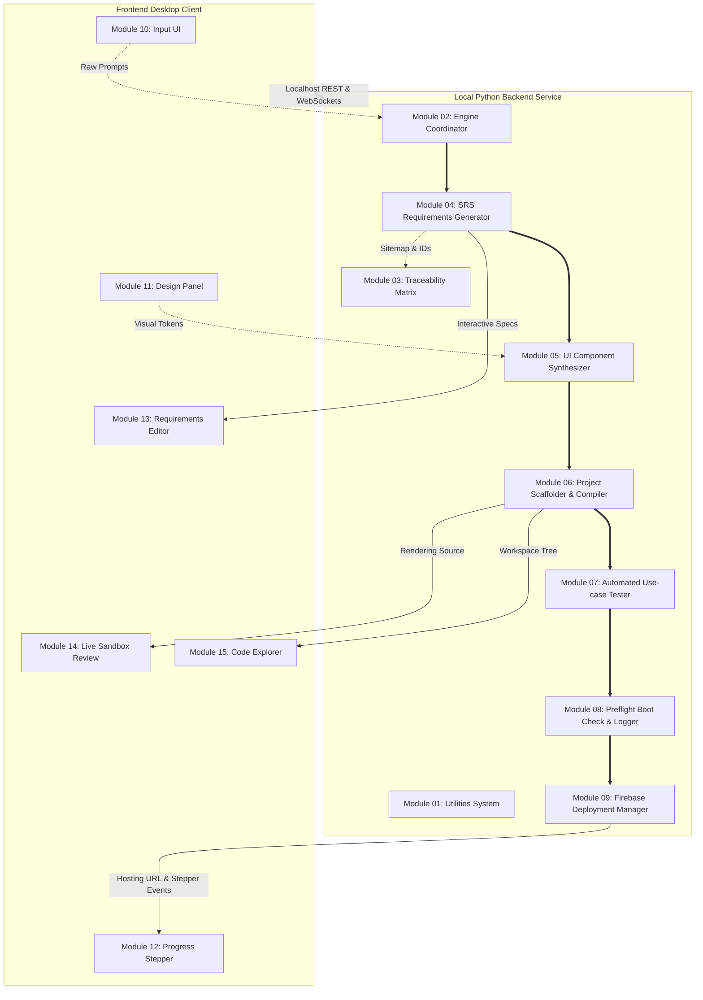
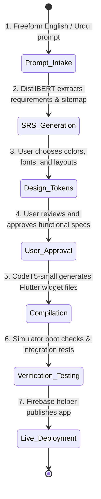

# <div align="center">🧞 Jinie</div>

## <div align="center">AI-Driven UI to Flutter Application Generation</div>

<div align="center">

[](#)
[](#)
[](#)
[](#)
[](#)
[](#)

</div>

---

### <div align="center">"Bridging the space between imagination and production-ready mobile code."</div>

Jinie is an intelligent, localized desktop pipeline engineered by **Ahmad Hassan (B-Ted)**, **Ansa Anwaar**, **Kaneez Zehra**, and **Chaudry Ali Sher**. It transforms plain text descriptions—supporting English, Urdu, and code-mixed Urdu-English (Roman Urdu)—into complete, runnable, and Firebase-hosted Flutter applications.

Rather than wrapping public third-party APIs, Jinie utilizes self-trained, specialized machine learning models to classify requirements, recommend screen layouts, and generate widget hierarchies. This architectural choice secures speed, reproducibility, and full local execution capability.

---

## 🧭 Architecture Overview

Jinie relies on a decoupled, client-server desktop model. The frontend desktop client hosts the interface controls, and the Python service layer handles NLP requirement processing, code compilation, and preflight testing.



---

## ⚡ System Workflow

The generation pipeline moves through seven distinct checkpoints:



---

## 📦 Internal Module Structure

### Backend Modules (`backend/`)

| Module                      | Submodule / File                                                                | Responsibility                                                                            |
| :-------------------------- | :------------------------------------------------------------------------------ | :---------------------------------------------------------------------------------------- |
| **01. Utilities**           | `file_handler`, `code_editor`, `md_converter`, `reformatter`, `env_setup`, `vv` | File operations, formatting, markdown parses, environment setup, and verification checks. |
| **02. Engine**              | `reframer`, `feedback`, `state`                                                 | Maintains state snapshots, rewrites inputs, routes user reviews.                          |
| **03. Traceability**        | `id_assigner`                                                                   | Allocates unique hierarchical trace identifiers to elements.                              |
| **04. SRS Generator**       | `requirement`, `sitemap`, `functional`, `non_functional`, `stack_identifier`    | Requirement classifiers, sitemap builders, stack identifiers.                             |
| **05. Component Generator** | `generator`                                                                     | Selects layouts using design tokens; curates widget code.                                 |
| **06. Compiler**            | `compiler`                                                                      | Links widget routes, styles, and scaffold configs.                                        |
| **07. Tester**              | `tester`                                                                        | Generates and executes test suites on compiled code.                                      |
| **08. Logger**              | `logger`                                                                        | Tracks operations; performs preflight checks and login validation.                        |
| **09. Deployment**          | `firebase_helper`                                                               | Configures and deploys build assets to Firebase Hosting.                                  |

### Frontend UI Components (`frontend/src/components/`)

| Component Folder      | Module    | Subcomponents                                                             | Key Responsibility                                             |
| :-------------------- | :-------- | :------------------------------------------------------------------------ | :------------------------------------------------------------- |
| **InputInterface**    | Module 10 | `PromptInputBox`, `FileUploader`                                          | Freeform text intake area and attachments coordinator.         |
| **DesignPreferences** | Module 11 | `ColorPalette`, `Typography`, `LayoutMode`, `ThemeToggle`                 | Dynamic styling configuration swatches.                        |
| **ProgressStatus**    | Module 12 | `StageTracker`, `LiveLogStream`, `ErrorAlerts`, `Controls`                | Progress monitor, real-time log terminal, build controls.      |
| **SRSViewer**         | Module 13 | `RequirementListView`, `InlineEditor`, `ApprovalToggle`, `IDBadgeDisplay` | Requirement verification grid, inline editors, and check-offs. |
| **LiveReview**        | Module 14 | `ComponentPreview`, `FullAppPreview`, `DeviceToggle`, `FeedbackCapture`   | Sandboxed simulator displaying preview widgets.                |
| **CodeExplorer**      | Module 15 | `FileTreeView`, `SyntaxEditor`, `DownloadZIP`, `TraceabilityLink`         | File browser and ZIP packaging bundle triggers.                |

---

## 🔄 Data Flow

The flow of inputs and outputs through the self-trained ML model endpoints is structured as follows:


---

## 🛠️ Request Lifecycle & Build Pipeline

<details>
<summary>🔍 View Detailed Request Lifecycle</summary>

1. **Intake**: A text prompt (e.g. Roman Urdu text outlining product pages) is submitted through the `PromptInputBox`.
2. **Reframing**: The `EngineReframer` translates colloquialisms and prepares a standardized problem target.
3. **Extraction**: `RequirementGenerator` triggers the local `DistilBERT` classifier to list required categories and screens.
4. **Site Scaffolding**: `SitemapGenerator` configures navigation paths.
5. **Interactive Checkpoint**: The client app renders the specification list. Execution pauses until requirements are checked and approved.
6. **Widget Compilation**: Once approved, the `ComponentGenerator` reads styling tokens and triggers `CodeT5-small` iterations, building Dart UI widgets.
7. **Scaffolding Integration**: The `Compiler` packages the code, inserting imports and configuration files.
8. **Automated Verification**: `Tester` triggers Dart integration check suites.
9. **Boot Safety Check**: The `Logger` verifies the application boots cleanly, executing authentication endpoints.
10. **Cloud Deploy**: `FirebaseHelper` packages the assets and pushes them live.
</details>

---

## 📂 Repository Structure

```text
jinie-desktop/
├── .docs/                  # Conceptual & technical documentation index
│   ├── README.md           # Documentation guide
│   ├── api.md              # REST & WebSockets contracts
│   ├── architecture.md     # Module connections and architecture diagrams
│   ├── ai_models.md        # Dataset specifications & model training summaries
│   └── development.md      # Workspace prerequisites & environment details
├── backend/                # Local Python Service Layer
│   ├── main.py             # Entry server loop
│   ├── requirements.txt    # Python packaging dependencies
│   ├── utilities/          # Shared filesystem handlers, formatters, & V&V gates
│   ├── engine/             # State trackers & prompt parsers
│   ├── traceability/       # Traceability Matrix index systems
│   ├── srs/                # Requirements & sitemap compiler
│   ├── component_generator/# Layout generators
│   ├── compiler/           # Project assembly controllers
│   ├── tester/             # Unit & integration testing modules
│   ├── logger/             # Activity diagnostics & preflight checks
│   └── deployment/         # Firebase hosting deployment scripts
└── frontend/               # User Interface Client Shell
    ├── package.json        # Node scripts & dependencies
    ├── vite.config.ts      # Vite compilation configurations
    ├── src/
    │   ├── main.tsx        # UI entry hook
    │   ├── App.tsx         # Layout controller
    │   └── components/     # UI panel directories (Input, Design, Progress, SRS, Preview)
```

---

## 💻 Development Workflow

### Prerequisites

- **Node.js** (v18.0.0 or higher)
- **Python** (v3.10 or higher)
- **Flutter SDK** (for pipeline compilation output testing)

### Setup & Local Development

1. **Backend Configuration**:

   ```bash
   cd backend
   python -m venv venv
   # On Windows:
   .\venv\Scripts\activate
   # On macOS/Linux:
   source venv/bin/activate

   pip install -r requirements.txt
   python main.py
   ```

2. **Frontend Configuration**:
   ```bash
   cd frontend
   npm install
   npm run dev
   ```

### Verification Checks

Before contributing code updates, the local workspace can be validated using the build and import scripts:

```bash
# Verify Python modules load cleanly
python -c "import utilities, engine, traceability, srs, component_generator, compiler, tester, logger, deployment"

# Validate Frontend React compilation outputs
cd frontend
npm run build
```
